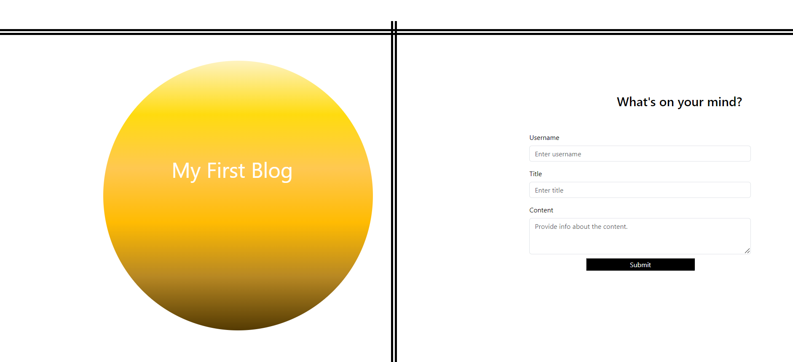

# Personal-Blog-Module-4

## Description

This project is a personal blog for a marketing student to showcase thoughts and experiences. The blog allows users to create, view, and store blog posts locally in the browser.

## Usage

- Open the page in your web browser.
- Fill out the form with your username, blog title, and blog content.
- Submit the form to store the blog and be redirected to the posts page.
- View the posts page to see a list of all blog posts.
- Click the "Back" button to return to the landing page and add more blog entries.

## Credits

Developer: Alanna Johnson-Garza 
https://github.com/ajgarza27

Repository: https://github.com/ajgarza27/Personal-Blog-Module-4.git

Deployed URL: https://ajgarza27.github.io/Personal-Blog-Module-4/

Received tutor assistance via Preply.

## License

This project is licensed under the MIT License.